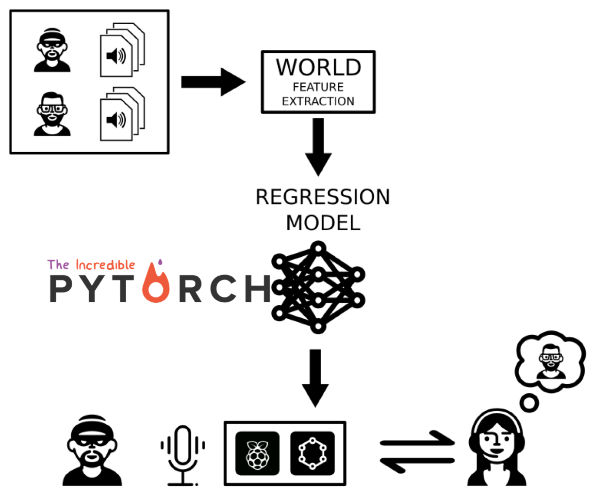
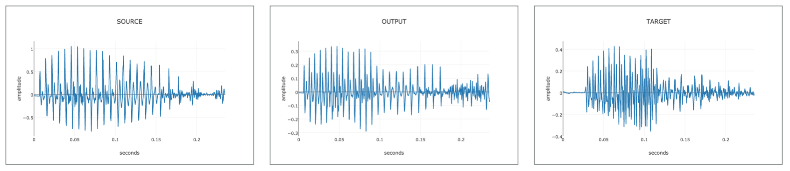
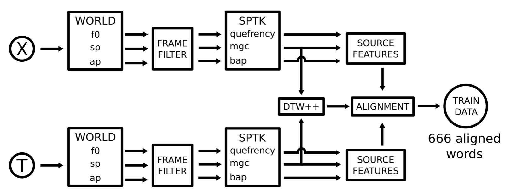
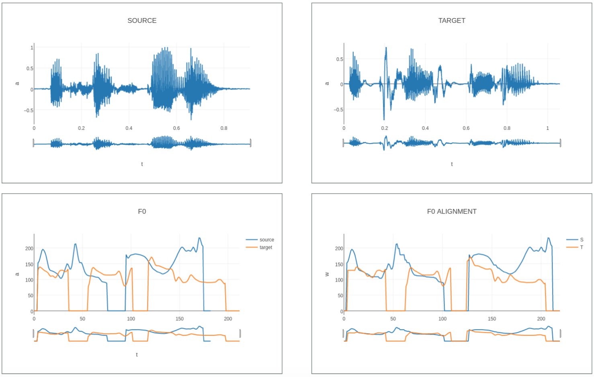

# tiger-costume Voice Conversion project

A lightweight tool for performing voice conversion written in Python
with Pytroch and Numpy. It is mainly composed
of two parts. A voice alignment algorithm and a regression model.

## Voice Conversion

Voice conversion is the task of modifying the speech signal of one speaker
(source speaker) so that it sounds as if it had been pronounced by a different speaker (target speaker).



We use a parametric method for voice generation. Raw waveforms are converted to
fundamental frequency (f0), spectral envelope coeficients (SP) and band aperiodicity coeficients (AP) for processing
using the WORLD codec. They are then converted to log_f0 and Mel Generalized Cepstral Coefficients
using SPTK. In order to regenerate synthetic waveforms, these conversions
are inverted. Note that this is a lossy process.
A 25ms window is used for utterance allignment. A 5ms window is used for waveform generation.



In order to build a training set, we use  . We allign these utterances, frame
by frame, using a modified version of the Dinamic Time Warping (DTW) algorithm.
We use the alligned frames to train a regression model which takes the source speaker's
audio data as input and outputs the converted frame parameters such that the
reconstructed waveform sounds matches that of the target speaker.
In this case we do regression frame by frame with a feed forward network.
However, we use contextual information by including delta features
(parameter time derivatives) using Maximum Likelihood Parameter Generation MLPG.

For a more in depth overview see the project <a href="slides.pdf" download>slides.pdf</a>

## Alignment





We do this in the [Dataset_Analysis.ipynb](https://github.com/JavierAntoran/tiger-costume/blob/master/Notebooks/Dataset%20Analysis.ipynb) Notebook.

Note that you will have to run the notebook yourself as plotly plots are not displayed automatically.
## Model Training and MLPG

This is shown in the [Run_Models.ipynb](https://github.com/JavierAntoran/tiger-costume/blob/master/Notebooks/Run_Models.ipynb) Notebook.

Note that you will have to run the notebook yourself as plotly plots are not displayed automatically.
## Running the voice conversion

```bash
python hobbes.py
```


## Other resources

This project uses the WORLD vecoder http://www.kki.yamanashi.ac.jp/~mmorise/world/english/
Implemented through pyWORLD: https://github.com/JeremyCCHsu/Python-Wrapper-for-World-Vocoder

It also uses the Speech Signal Processing Toolkit, SPTK http://sp-tk.sourceforge.net implemented through pySPTK https://github.com/r9y9/pysptk

An assortment of voice generation / conversion publications can be found
in the [papers](https://github.com/JavierAntoran/tiger-costume/tree/master/papers) folder.

**Other VC repos:**
* Merlin voice conversion toolkit (uses neural networks) https://github.com/CSTR-Edinburgh/merlin
* Code for recent GMM based VC publication https://github.com/k2kobayashi/sprocket
* GMM, MLPG based VC tutorial by r9y9 (**very good**) https://r9y9.github.io/nnmnkwii/v0.0.1/nnmnkwii_gallery/notebooks/vc/01-GMM%20voice%20conversion%20(en).html
* GAN based VC https://github.com/r9y9/gantts
* Deep VC without parallel uterances, using a phoneme classifier https://github.com/andabi/deep-voice-conversion


